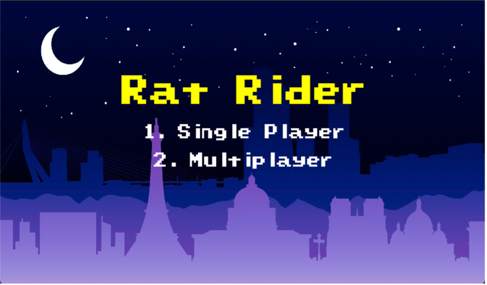
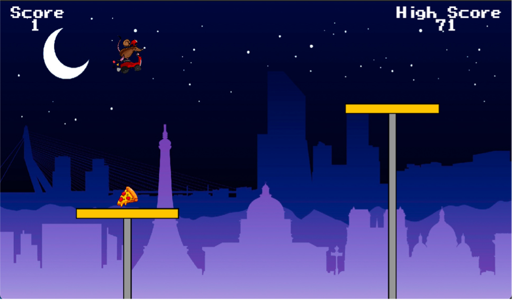
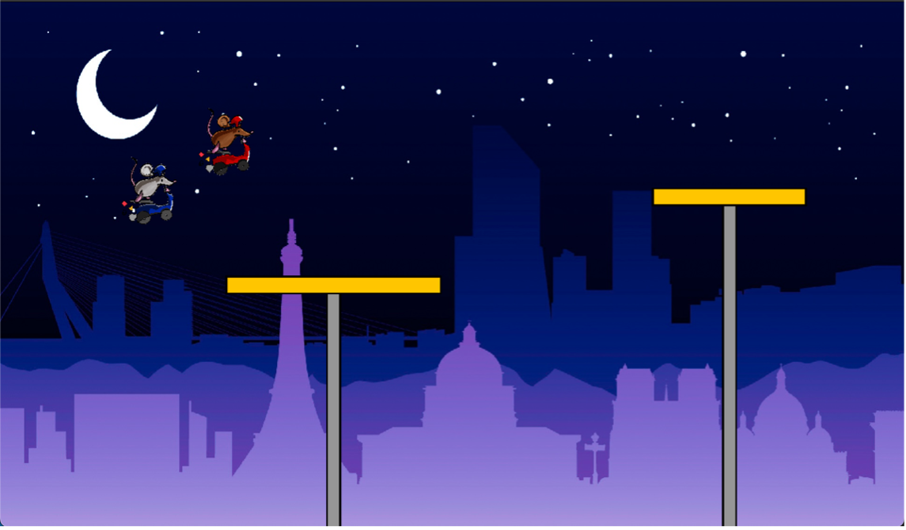
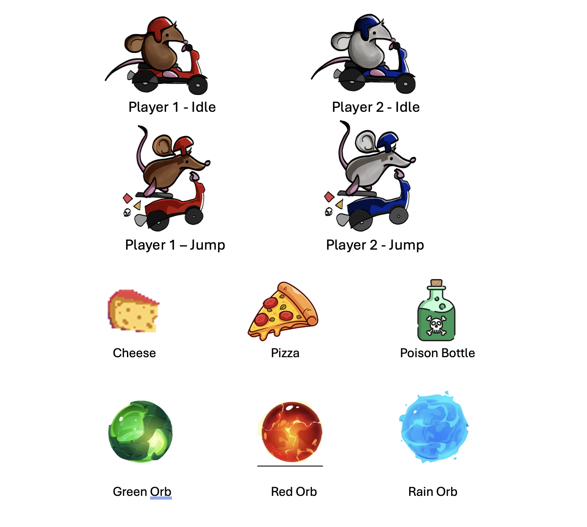

# Rat Rider 

A physics-based 2D platformer built in **C++** using **SFML 2.6.2** and **Box2D 2.4.1**, developed as part of the *Object Oriented Programming* course at IBA Karachi (Spring 2025).

Features single-player and local multiplayer modes, a full collectibles system, persistent high score, and procedurally generated platforms.

---

## Gameplay

Platforms of randomized lengths, heights, and speeds scroll in from the right. Your goal is to keep jumping between them and survive as long as possible — while collecting power-ups and avoiding hazards.



### Single Player
- Collect items to boost your score
- Platform speed increases over time
- High score is saved between sessions



### Multiplayer (Local)
- Two players on the same keyboard
- Last one standing wins
- No collectibles — pure survival



---

## Collectibles

| Item        | Effect                                        |
|-------------|-----------------------------------------------|
| 🧀 Cheese   | +1 score                                      |
| 🍕 Pizza    | +3 score                                      |
| ☠️ Poison   | −2 score                                      |
| 🟢 Green Orb | Lengthens platforms for 10 seconds           |
| 🔴 Red Orb  | Shortens platforms for 10 seconds             |
| 🔵 Rain Orb | Triggers cheese rain for 10 seconds           |



---

## Controls

| Action       | Player 1     | Player 2 |
|--------------|--------------|----------|
| Jump         | ↑ / W        | W        |
| Fast Fall    | ↓ / S        | S        |

---

## Project Structure

```
RatRider/
├── src/
│   ├── main.cpp          # Game loop, event handling, rendering
│   ├── Game.cpp          # World init, game state management
│   ├── Player.cpp        # Player physics, jump, fall mechanics
│   ├── Platform.cpp      # Platform spawning, movement, removal
│   ├── Collectible.cpp   # Collectible spawning, effects, collision
│   ├── Contact.cpp       # Box2D contact listener (collision callbacks)
│   ├── ControlRoom.cpp   # Game logic: scoring, speed, power-up timers
│   ├── Textures.cpp      # Asset loading (sprites, sounds)
│   └── Utility.cpp       # Unit conversion, shared helpers
├── headers/              # Header files for all above modules
├── resources/
│   ├── textures/         # Sprite sheets and backgrounds
│   ├── sounds/           # SFX and background music
│   └── fonts/
├── masla.hpp             # Shared constants and configuration
├── Makefile
└── highscore.txt         # Persistent high score storage
```

---

## Dependencies

- [SFML 2.6.2](https://www.sfml-dev.org/) — windowing, rendering, audio
- [Box2D 2.4.1](https://box2d.org/) — physics simulation

---

## Build Instructions

### Linux / macOS
```bash
# Install dependencies (Ubuntu)
sudo apt install libsfml-dev

# Clone and build
git clone https://github.com/yourusername/RatRider.git
cd RatRider
make
./main
```

### Windows
Set up SFML and Box2D with your compiler of choice (MSVC or MinGW), link the libraries, and compile all `.cpp` files in `src/`.

---

## Key Technical Challenges Solved

**Platform friction & player movement** — Overrode Box2D's `PreSolve` callback to zero out friction, allowing the player to move naturally with a kinematic platform rather than sliding off.

**Fast-fall feel** — Replaced raycast-based snapping (which looked like teleporting) with a gravity multiplier triggered on key hold, giving a natural fast-fall that also works mid-air.

**Multiplayer fairness** — Removed collectibles from multiplayer entirely after realizing the leading player had an unfair advantage collecting everything first. Switched to a pure survival format.

**Platform overlap prevention** — Added a bounding box check before spawning each platform; overlapping candidates are discarded and their Box2D bodies immediately destroyed.

---

## Team

- Anser Abbas
- Sudheer Rathore
- Saad Ahmed 

*IBA Karachi · Object Oriented Programming · Spring 2025*
